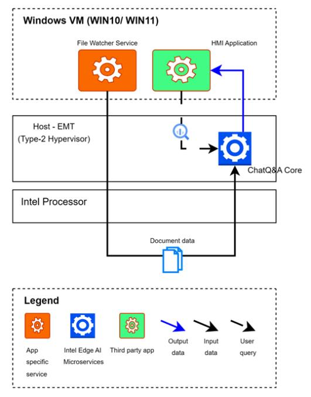

# Overview

Integrating Large Language Models (LLMs) with Retrieval-Augmented Generation (RAG) into Human Machine Interface (HMI) systems offers a substantial opportunity to enhance the capabilities of manufacturing machine operators, especially those who are less experienced. RAG LLM applications deliver a user-friendly interface for troubleshooting advice, data summarization, and planning, utilizing a knowledge base tailored to specific deployments, including telemetry data, support logs, machine manuals, and production plans. This document details the use cases, architectures, and requirements for implementing RAG LLMs in HMI systems to improve operational efficiency, decision-making, and overall productivity for machine operators.

## How it works

## High-Level Architecture

From the architecture diagram, the system has a RAG LLM Chat Question and Answer Core application which utilized RAG LLM running alongside the typical HMI applications. A knowledge base is initialized using the available documentation such as user manuals, past maintenance or support logs. When an operator detects a problem, either through direct observation or via the HMI application, they can consult the RAG LLM for troubleshooting advice or explanations. After resolving the issue, the operator records a support log entry detailing the problem, the solution, and any relevant data. This log entry is then added to the knowledge base to aid in future troubleshooting efforts.

---

### Chat Question-and-Answer Core (ChatQ&A Core)

The ChatQ&A Core sample application serves as a basic Retrieval Augmented Generation (RAG) pipeline, allowing users to pose questions and obtain answers, even from their private data corpus. This sample illustrates the construction of RAG pipelines. It is designed for minimal memory usage, being developed as a single, monolithic application with the complete RAG pipeline integrated into one microservice.

For further details, please visit [Chat Question-and-Answer Core Sample Application Overview](https://github.com/open-edge-platform/edge-ai-libraries/blob/main/sample-applications/chat-question-and-answer-core/docs/user-guide/overview.md)

---

### File Watcher Service

The File Watcher Service runs alongside with HMI application on the Windows environment, consistently observing file system activities like creation, modification, and deletion. When changes are detected, it sends the pertinent file data over the network to the ChatQ&A service for ingestion and contextual processing, facilitating Retrieval-Augmented Generation (RAG) workflows.

---

### Human Machine Interface(HMI) Application

A Human-Machine Interface(HMI) can vary depending on the use case or the creator. While HMIs generally serve as interfaces connecting users to machines, systems, or devices, their design and functionality can differ significantly based on the particular requirements of an industrial process or the preferences of the developer.

---

## Summary

This document provides an overview of the architecture for HMI Augmented Worker sample application utitlizes LLM RAG workflow along with file watcher service.

For more comprehensive guidance on beginning, please consult the [Getting Started Guide](./get-started.md).