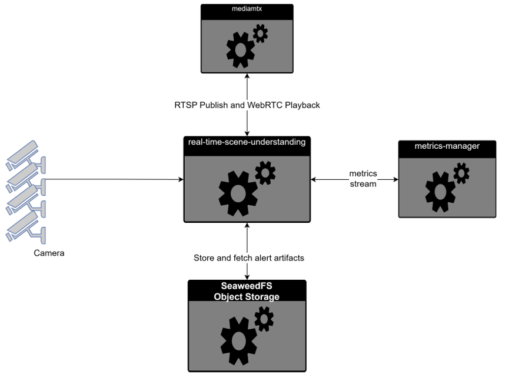

# Real Time Scene Understanding

Real Time Scene Understanding is a real-time video monitoring application that ingests RTSP camera streams, renders low-latency browser playback over WebRTC, and runs AI-based alert detection with deep multi-frame analysis.


## Get Started

To see the system requirements and other installation, see the following guides:

- [System Requirements](): Check the hardware and software requirements for deploying the application.

- [Get Started](./docs/user-guide/get-started.md): Step-by-step instructions to set up the application.


## How It Works

The system ingests RTSP camera streams, relays low-latency WebRTC video to the browser through MediaMTX, and in parallel samples frames for VLM-based alert gating. When an alert is detected, a deep multi-frame analyzer processes finalized segments, stores artifacts in SeaweedFS, and serves alert history/details to the dashboard through API endpoints.

High-level Real Time Scene Intelligence service flow:



```text
RTSP Cameras
    |
    v
Stream Handling Service (PyAV)
    |-- Live Relay Path ---> MediaMTX ---> Browser UI
    |
    |-- Alert Path --------> Alert VLM Gate Service
                                        |
                                        v
                              Deep Analyzer Service
                                        |
                                        v
                          SeaweedFS Object Storage
                                        |
                                        v
                             Alert API Service -----> Browser UI
```

For a detailed view of Real Time Scene Intelligence internal processing, see [docs/user-guide/how-it-works.md](docs/user-guide/how-it-works.md).

## Learn More

- [Get Started](./docs/user-guide/get-started.md) - Quick deployment guide
- [Overview](./docs/user-guide/index.md) - Features and architecture
- [System Requirements](./docs/user-guide/get-started/system-requirements.md) - Hardware and software needs
- [Build from Source](./docs/user-guide/get-started/build-from-source.md) - Custom build instructions
- [Release Notes](./docs/user-guide/release-notes.md) - Changelog and known issues
- [API Reference](./docs/user-guide/api-reference.md) - REST API endpoints
