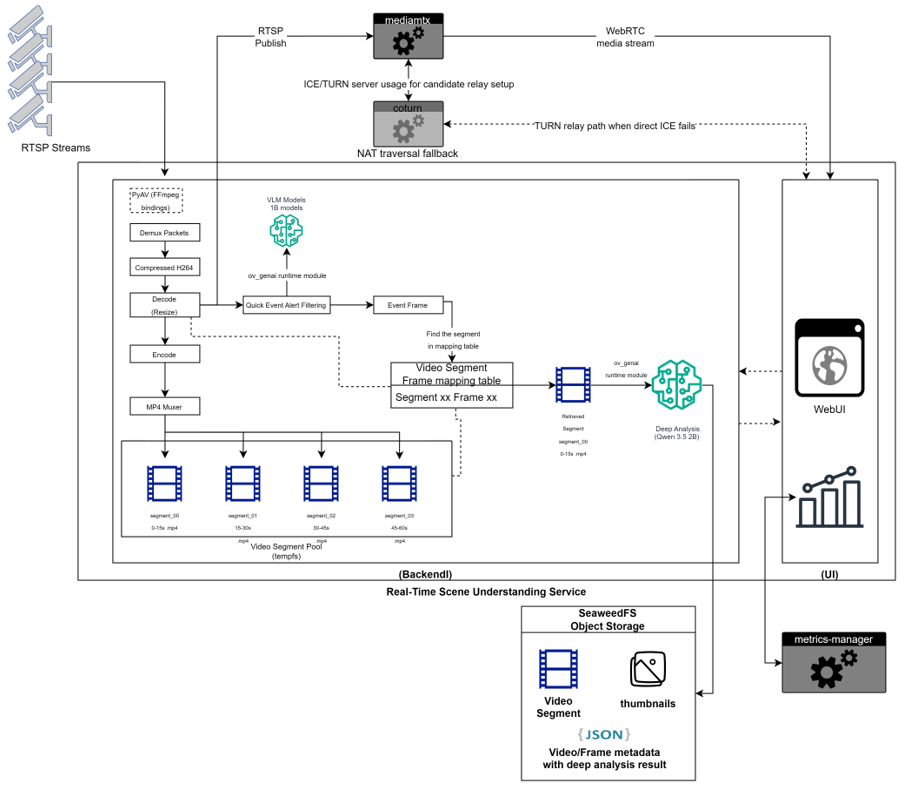
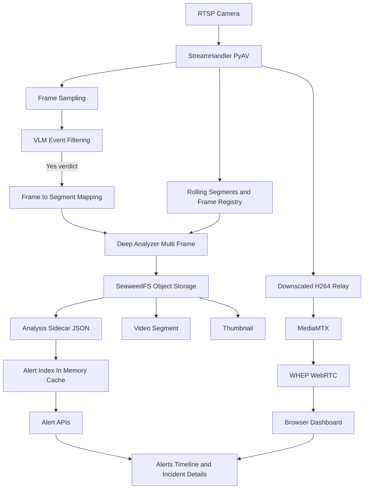

# How It Works

Real Time Scene Intelligence is a suite of applications that ingest RTSP camera streams, relay low-latency WebRTC video to the browser through MediaMTX, and in parallel sample frames for VLM-based alert gating. When an alert is detected, a deep multi-frame analyzer processes finalized segments, stores artifacts in SeaweedFS, and delivers alert history and details to the dashboard through API endpoints.

## Architecture Overview

### Runtime Services

Real Time Scene Understanding is the main application service that orchestrates stream ingest, alert analysis, and dashboard APIs.

- Real Time Scene Understanding: FastAPI backend and browser UI for stream control, live view, and alert history/details.
- MediaMTX: RTSP ingest target and WebRTC/WHEP playback service.
- Coturn: TURN server used by WebRTC.
- Metrics-Manager: SSE metrics endpoint for CPU, RAM, GPU, and NPU visualization.
- Seaweedfs Object Storage: S3-compatible object storage for alert artifacts.

## Data Flow

1. RTSP camera input is ingested by StreamHandler PyAV, which splits processing into a live relay path and an analysis path.
2. In the live relay path, frames are downscaled to H264, sent to MediaMTX, and delivered over WHEP WebRTC to the browser dashboard.
3. In the analysis path, sampled frames go through VLM event filtering, and Yes verdicts are mapped to the related rolling segment via the frame registry.
4. Deep Analyzer performs multi-frame analysis on the mapped segment and writes artifacts to SeaweedFS object storage.
5. SeaweedFS outputs include video segments, thumbnails, and analysis sidecar JSON; sidecar records update the in-memory alert index, which powers Alert APIs and the alerts timeline and incident details view.

## Learn More

- [System Requirements](./get-started/system-requirements.md)
- [Get Started](./get-started.md)
- [API Reference](./api-reference.md)
- [Known Issues](./known-issues.md)
- [Release Notes](./release-notes.md)
